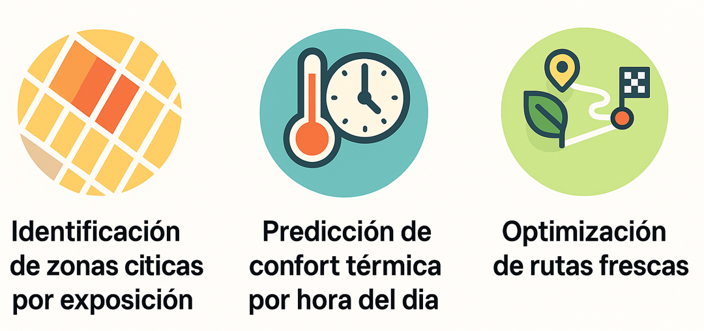

# cool-routes

## Motivación del proyecto

Chile y el mundo enfrentan un alza de temperatura. Las proyeciones indican temperaturas máximas por sobre los 35ºC en el futuro inmediato ([simuladores.cr2.cl](https://simulaciones.cr2.cl/)). Esto, combinado con la falta de áreas verdes en algunas comunas, crean un escenario en el cual, caminar por la ciudad puede resultar en una experiencia desalentadora, dando paso a preferir circular en automóvil, incluso para traslados muy cortos.

**cool-routes** es un proyecto en desarrollo con un enfoque de **Machine Learning**, cuyo propósito es es construir una **aplicación que permita recomendar rutas peatonales “más frescas”**, combinando información geoespacial y variables ambientales derivadas desde **Google Earth Engine (GEE)** (datos estáticos de referencia), APIs de estaciones meteorológicas, proyecciones de sombra sobre las veredas y preferencias del usuario (datos dinámicos).



En esta etapa se documenta un **avance técnico inicial**, centrado en diseñar un flujo **robusto, modular y reproducible** para la generación, exportación y sincronización de datos.

---

## Objetivo del proyecto

Desarrollar una aplicación que permita:

* Evaluar rutas peatonales alternativas
* Priorizar recorridos con menor exposición térmica
* Integrar información ambiental (ej. temperatura superficial, cobertura vegetal)
* Servir resultados de forma reproducible y escalable

Este avance se enfoca exclusivamente en la **capa de datos y automatización**, no en la interfaz de usuario.

---

## Estado actual

Flujo de datos funcional de extremo a extremo

* Autenticación OAuth 2.0 con Google
* Generación de imágenes y outputs geoespaciales desde GEE
* Exportación automática de resultados a Google Drive
* Sincronización y descarga local incremental

 El énfasis ha estado en **arquitectura, separación de responsabilidades y control del entorno**

---

## Arquitectura del flujo

```text
[ Google Earth Engine ]
           ↓
[ Exportación automatizada ]
           ↓
[ Google Drive ]
           ↓
[ Sincronización local ]
```

Cada bloque está desacoplado y encapsulado en módulos independientes, permitiendo:

* Reejecución parcial del pipeline
* Debugging aislado
* Evolución incremental hacia un pipeline más complejo

---

## Organización del proyecto

```text
cool_routes/
├── pipelines/                    # Orquestadores para la obtención de la información base
│   ├── gee_bootstrap/            # DAG 0
│   │   ├── export_buildings.py
│   │   ├── export_ndvi.py
|   |   ├── export_lst.py
│   │   ├── sync_drive.py         # Integración con Google Drive API
│   │   └── README.md
├── src/
│   ├── cool_routes/
│   │   ├── __init__.py
│   │   │
│   │   ├── ingest/                
│   │   │   ├── gee.py           # Lógica de extracción y procesamiento en GEE
│   │   ├── utils/               # Funciones auxiliares
|   |                
├── config/                      # Se alojan archivos yaml de configuración          
│   ├── gee/
│   │   ├── export_buildings.yaml
│   │   ├── export_ndvi.yaml
│   │   ├── export_lst.yaml
│   ├── regions/                  # Áreas de interés (ROI)
│   ├── sync_drive/  
|           
│
├── notebooks/                    # Notebooks demostrativos (en construcción)
│
├── pyproject.toml                # Gestión de dependencias (Poetry)
├── README.md

```
---

## Próximos pasos

* Parametrización mediante archivos de configuración
* Logging estructurado
* Manejo de errores y retries
* Versionado de outputs
* Integración con modelos de routing
* Preparación para despliegue (CLI / servicio)

---

## Ejecución del pipeline

### 1. Clonar el repositorio

```bash
git clone <repo-url>
cd cool_routes
```

### 2. Crear y activar el entorno (Poetry)

```bash
poetry install
```

Esto instalará todas las dependencias definidas en `pyproject.toml` y utilizará el entorno virtual asociado al proyecto.

### 3. Verificar autenticación

Para ejecutar el pipeline, se debe haber configurado previamente las credenciales  OAuth para Google Drive y Google Earth Engine (tutorial en construcción)

Archivos esperados (no versionados):

```text
credentials.json
token.json   # se genera automáticamente tras la primera autenticación
```

---

## Stack

* Python
* Google Earth Engine API
* Google Drive API
* Poetry (gestión de dependencias)
