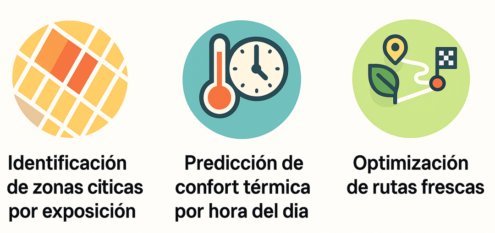

# cool-routes

## Motivación del proyecto

Chile y el mundo enfrentan un alza de temperatura. Las proyeciones indican temperaturas máximas por sobre los 35ºC en el futuro inmediato ([simuladores.cr2.cl](https://simulaciones.cr2.cl/)). Esto, combinado con la falta de áreas verdes en algunas comunas, crean un escenario en el cual, caminar por la ciudad puede resultar en una experiencia desalentadora, dando paso a preferir circular en automóvil, incluso para traslados muy cortos.

**cool-routes** es un proyecto en desarrollo cuyo propósito es construir **una aplicación capaz de recomendar rutas peatonales “más frescas”**, combinando información geoespacial y variables ambientales derivadas desde **Google Earth Engine** —como temperatura superficial (LST), NDVI y cobertura de sombra— junto con datos dinámicos provenientes de APIs de estaciones meteorológicas y preferencias del usuario.

El enfoque actual consiste en utilizar estas variables ambientales para **estimar índices biometeorológicos de confort térmico**, como la **Temperatura Equivalente Fisiológica (PET)**, e incorporarlos dentro de una función de costo utilizada por algoritmos de ruteo sobre grafos, como Dijkstra's algorithm.



En esta etapa se documenta un **avance técnico inicial**, centrado en diseñar un flujo **robusto, modular y reproducible** para la generación, exportación y sincronización de datos.

---

## Objetivo del proyecto

Desarrollar una aplicación que permita:

* Evaluar rutas peatonales alternativas
* Priorizar recorridos con menor exposición térmica
* Integrar información ambiental (ej. temperatura superficial, cobertura vegetal)
* Servir resultados de forma reproducible y escalable

Este avance se enfoca exclusivamente en la **capa de datos y automatización**, no en la interfaz de usuario.

---

## Estado actual

Flujo de datos funcional de extremo a extremo

* Autenticación OAuth 2.0 con Google
* Generación de imágenes y outputs geoespaciales desde GEE
* Exportación automática de resultados a Google Drive
* Sincronización y descarga local incremental

 El énfasis ha estado en **arquitectura, separación de responsabilidades y control del entorno**

---

## Arquitectura del flujo

```text
[ Google Earth Engine ]
           ↓
[ Exportación automatizada ]
           ↓
[ Google Drive ]
           ↓
[ Sincronización local ]
```

Cada bloque está desacoplado y encapsulado en módulos independientes, permitiendo:

* Reejecución parcial del pipeline
* Debugging aislado
* Evolución incremental hacia un pipeline más complejo

---

## Organización del proyecto

```text
cool_routes/
├── pipelines/                    # Orquestadores para la obtención de la información base
│   ├── gee_bootstrap/            # DAG 0
│   │   ├── export_buildings.py
│   │   ├── export_ndvi.py
|   |   ├── export_lst.py
│   │   ├── sync_drive.py         # Integración con Google Drive API
│   │   └── README.md
├── src/
│   ├── cool_routes/
│   │   ├── __init__.py
│   │   │
│   │   ├── ingest/                
│   │   │   ├── gee.py           # Lógica de extracción y procesamiento en GEE
│   │   ├── utils/               # Funciones auxiliares
|   |                
├── config/                      # Se alojan archivos yaml de configuración          
│   ├── gee/
│   │   ├── export_buildings.yaml
│   │   ├── export_ndvi.yaml
│   │   ├── export_lst.yaml
│   │   ├── gee_id.yaml           # Id del proyecto en GEE
│   ├── regions/                  # Áreas de interés (ROI)
│   ├── sync_drive/  
│       ├── sync_drive.yaml
|           
│
├── notebooks/                    # Notebooks demostrativos (en construcción)
├── secrets/                      # Guarda credenciales de Google, No se versiona
│
├── pyproject.toml                # Gestión de dependencias (Poetry)
├── README.md

```
---

## Próximos pasos

* Parametrización mediante archivos de configuración
* Logging estructurado
* Manejo de errores y retries
* Versionado de outputs
* Integración con modelos de routing
* Preparación para despliegue (CLI / servicio)

---

## Instrucciones

### 1. Clonar el repositorio

```bash
git clone https://github.com/crisbebop/buscador_rutas_frescas.git
cd cool_routes
```

### 2. Crear y activar el entorno (Poetry)

```bash
poetry install
```  
Este comando instalará todas las dependencias definidas en `pyproject.toml` y creará un entorno virtual asociado al proyecto.   
Si utilizas VSCode, selecciona el intérprete de Python del entorno virtual del proyecto:  
Presiona ```Ctrl + Shift + P```  
Busca ```Python: Select Interpreter```  
Selecciona el intérprete ubicado dentro de la carpeta ```.venv``` ```(.venv/Scripts/python.exe en Windows)```  

### 3. Configurar GEE

#### 3.1 Id del proyecto

El proyecto utiliza imágenes descargadas directamente desde GEE, por lo que se debe tener una cuenta activa y un proyecto creado.  
Con el id del proyecto se debe crear el archivo de configuración correspondiente  
```config/gee/gee_id.yaml```  

```bash
# -------------------------------------------------
# Google Earth Engine Configuration
# -------------------------------------------------
gee:
  project_id: "mi-proyecto-gcp"
```
Esto vinculará el id de GEE para los pipelines para extracción de alturas, obtención de temperatura del suelo y obtención del índice de vegetación normalizado.  
```bash
export_buidldings.py  
export_lst.py
export_ndvi.py
```
#### 3.2 Área de Interés (ROI)

En ```config/regions``` se encuentran archivos `.yaml` que contienen la información de los límites comunales a ser utilizadas en los pipelines.  
Por el momento se cuenta con _Las Condes_ y _Quilicura_. Se pueden añadir las comunas necesarias.  

#### 3.3 Autenticarse en Google

Una vez que se ejcutan los pipelines `export_buidldings.py`, `export_lst.py`, `export_ndvi.py`, los archivos generados son enviados al root de Google Drive asociado a la cuenta de Google Earth Engine. El paso de autenticarse en Goolge se utiliza para sincronizar y descargar estos archivos en la carpeta `/data/reference`, de todas formas se puede hacer de forma manual.  
Para realizar la sincronización se requiere descargar las credenciales de Google y guardarlas en la carpeta `root/secrets/`.  
En general, el flujo es:  
**Paso 1. Crear OAuth Client en Google Cloud**  
APIs&Services -> Credentials -> Create OAuth Client ID  
**Paso 2. Descargar JSON**  
`client_secret_XXXXXXXX.json`  
**Paso 3. Renombrar**  
`google_oauth_credentials.json`  
**Paso 4. Guardarlo**  
En la carpeta (dentro de `/cool_routes`) es decir, `cool_routes/secrets/`  

Una vez guardada la credencial, se podrá ejecutar el pipeline `sync_drive.py`, el cual leerá leerá las credenciales y sincronizará los archivos generados por GEE y guardados en Google Drive.  
Tras la primera ejecución, pedirá confirmación desde el nevagador web.  
Luego se generará y guardará el "token" `google_oauth_token.json` en la misma carpeta `/secrets` y no volverá a pedir confirmación, en ejecuciones posteriores.  
Ver archivo de configuración en `config/sync_drive/sync_drive.yaml`  
<mark>IMPORTANTE</mark>: estas credenciales __NO deben ser compartidas por ningún motivo__.


### 4. Ejecutar Pipelines  
Hay 4 pipelines a ejecutar, la responsabilidad de cada uno es:  
1. `export_buildings.py`-> Orquesta la extracción de altura de edificios en formato `.geojson`.    
2. `export_lst.py`-> Orquesta la extracción de temperatura del suelo (LST: _Land Surface Temperature_) en formato `.tif`.  
3. `export_ndvi.py`-> Orquesta la extracción del Índice de Vegetación Normalizada (NDVI : _Normalized Difference Vegetation Index_) en formato `.tif`  
4. `sync_drive.py`-> Autenticación en Google Drive, búsqueda y descarga de los archivos creados.  

```bash
# Ejecución en una terminal
poetry run python pipelines/gee_bootstrap/export_buildings.py --region quilicura # Usar el ROI deseado, configurar en /config/regions  
poetry run python pipelines/gee_bootstrap/export_ndvi.py --region quilicura  
poetry run python pipelines/gee_bootstrap/export_lst.py --region quilicura  
poetry run python pipelines/gee_bootstrap/sync_drive.py  
```
---

## Stack

* Python
* Google Earth Engine API
* Google Drive API
* Poetry (gestión de dependencias)
